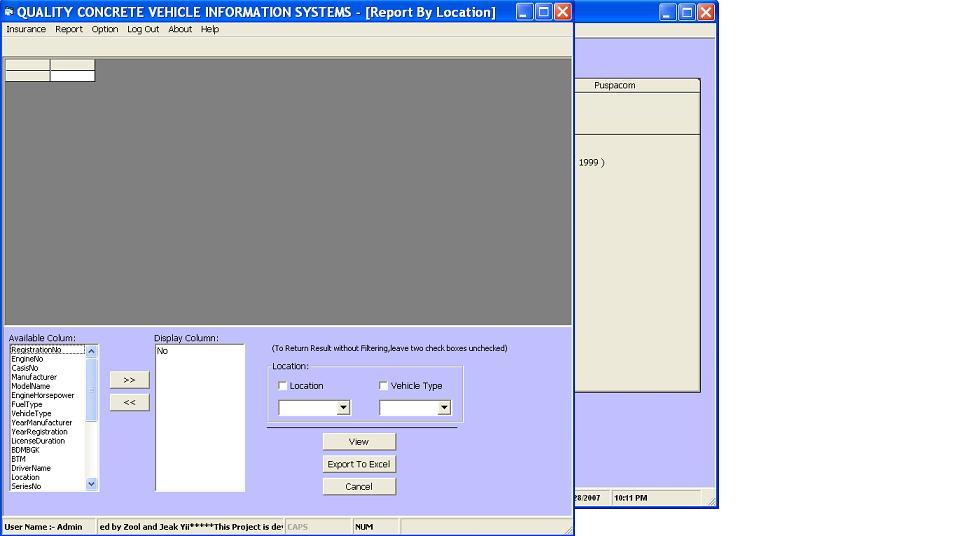



## Report Management Systems

### Description

This is a report management systems that manage two different kind of information,the motor insurance information and non motor insurance information such as. At certain period of time, some insurance for a particular vehicle need to be renewed and all details about the particular vehicle need to be reported to management.

This application will have the capapbilities to record insurance both non motor and motor insurance and produce a report for management to review. beside that,it is also capable of exporting to excel file.
 
### More Info
 

             |
---                |---
**Submitted On**   |2007-10-24 09:10:32
**By**             |[zool hilmi](https://github.com/Planet-Source-Code/PSCIndex/blob/master/ByAuthor/zool-hilmi.md)
**Level**          |Intermediate
**User Rating**    |3.8 (15 globes from 4 users)
**Compatibility**  |VB 3\.0, VB 4\.0 \(16\-bit\), VB 4\.0 \(32\-bit\), VB 5\.0, VB 6\.0
**Category**       |[Complete Applications](https://github.com/Planet-Source-Code/PSCIndex/blob/master/ByCategory/complete-applications__1-27.md)
**World**          |[Visual Basic](https://github.com/Planet-Source-Code/PSCIndex/blob/master/ByWorld/visual-basic.md)
**Archive File**   |[Report\_Man209593122008\.zip](https://github.com/Planet-Source-Code/zool-hilmi-report-management-systems__1-69859/archive/master.zip)

